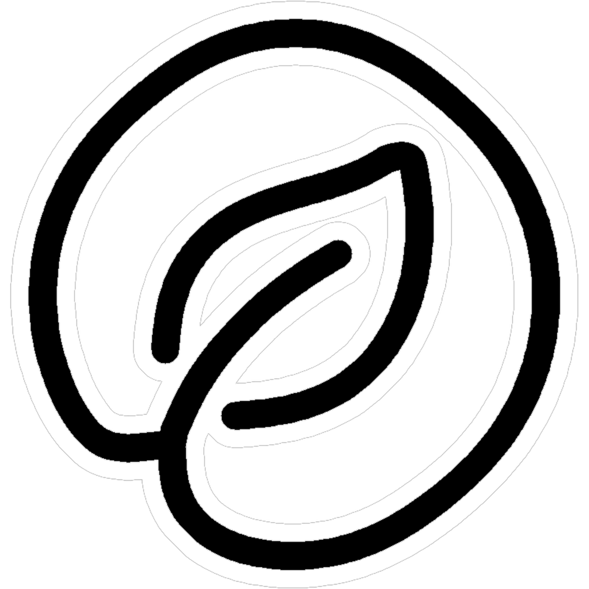
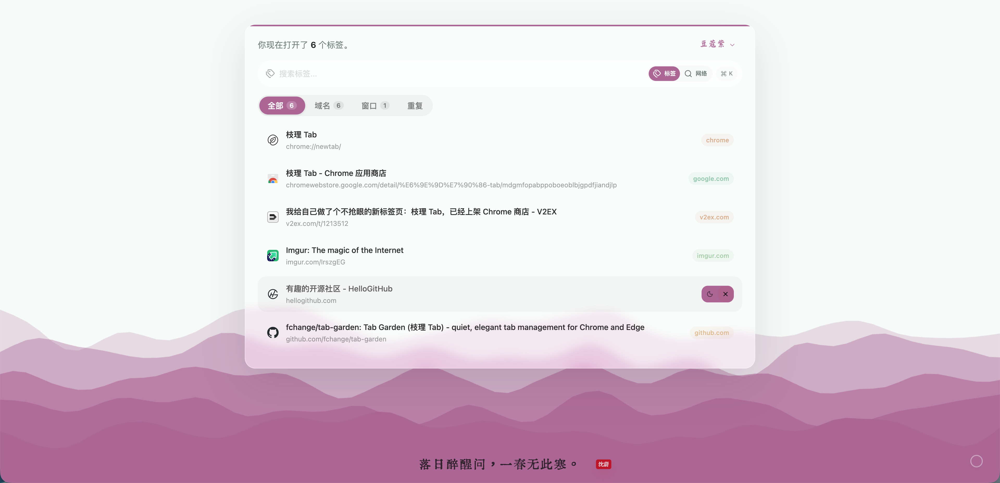

# Tab Garden / 枝理 Tab

<p align="center">
  
</p>

<p align="center">
  一个安静、清楚、轻盈的 Chrome / Edge 新标签页扩展。
</p>

<p align="center">
  <strong>整理枝叶，也整理标签。</strong>
</p>

Tab Garden（枝理 Tab）会接管浏览器的新标签页，把你当前打开的标签页重新整理成更容易理解和处理的视图：按域名归类、按窗口查看、找出重复标签、释放闲置标签，并提供一个不打扰的搜索入口。

它不是生产力仪表盘，也不是信息流首页。它只想帮你在标签页变多的时候，重新获得一点秩序感。

## 功能亮点

- **标签总览**：读取当前浏览器窗口中的标签页，在新标签页中集中展示。
- **快速搜索**：按标题和 URL 搜索已打开标签页，也可以切换到网页搜索模式。
- **多种视图**：支持全部、域名、窗口、重复 4 种视图。
- **重复整理**：识别重复标签，并支持一键关闭可安全关闭的重复项。
- **闲置释放**：把符合条件的标签页休眠，降低资源占用。
- **分组操作**：在域名组或窗口组中批量关闭重复、休眠或只保留一个标签。
- **保护规则**：默认保护固定标签、正在播放音频的标签和当前活跃标签。
- **本地设置**：主题、语言、默认视图、强调色、动画和保护规则会保存在本地。
- **东方色盘**：内置浅色 / 深色主题和一组偏东方审美的强调色。
- **诗文角落**：可选展示今日诗词，让新标签页保留一点呼吸感。
- **预览友好**：非扩展环境会自动使用 mock 数据，方便本地开发和调试 UI。

## 截图

<p align="center">
  
</p>

## 安装使用

### 从 Chrome Web Store 安装

[在 Chrome Web Store 安装枝理 Tab](https://chromewebstore.google.com/detail/%E6%9E%9D%E7%90%86-tab/mdgmfopabppoboeoblbjgpdfjiandjlp)

### 从 Microsoft Edge Add-ons 安装

[在 Microsoft Edge Add-ons 安装枝理 Tab](https://microsoftedge.microsoft.com/addons/detail/%E6%9E%9D%E7%90%86-tab/kiofelfncdejnllgnfklboigccpkbhjo?hl=zh-CN)

### 从源码加载

```bash
pnpm install
pnpm build
```

然后在 Chrome 中加载：

1. 打开 `chrome://extensions`
2. 开启“开发者模式”
3. 点击“加载已解压的扩展程序”
4. 选择 `.output/chrome-mv3`

在 Edge 中加载：

1. 打开 `edge://extensions`
2. 开启“开发人员模式”
3. 点击“加载解压缩的扩展”
4. 选择 `.output/edge-mv3`

加载完成后，新开一个标签页即可看到枝理 Tab。

### 开发模式

```bash
pnpm install
pnpm dev
```

Edge 开发模式：

```bash
pnpm dev:edge
```

## 常用脚本

- `pnpm dev`：启动 Chrome 开发模式。
- `pnpm dev:edge`：启动 Edge 开发模式。
- `pnpm build`：构建 Chrome MV3 扩展。
- `pnpm build:edge`：构建 Edge MV3 扩展。
- `pnpm zip`：打包扩展 zip。
- `pnpm typecheck`：运行 TypeScript 类型检查。
- `pnpm test`：运行 Node test runner 测试。

## 技术栈

- [WXT](https://wxt.dev/)：浏览器扩展开发框架。
- [React](https://react.dev/)：界面渲染。
- [TypeScript](https://www.typescriptlang.org/)：类型系统。
- [Tailwind CSS](https://tailwindcss.com/)：样式系统。
- Chrome Extension Manifest V3。

## 项目结构

```text
entrypoints/              WXT 扩展入口
  background.ts           工具栏图标点击行为
  newtab/                 新标签页入口
    index.html
    main.tsx

public/                   图标、Logo 等静态资源
src/
  components/             页面组件和业务组件
  components/settings/    设置面板相关组件
  components/ui/          基础 UI 组件
  hooks/                  React hooks
  lib/                    标签、搜索、存储、主题、URL 等核心逻辑
  styles/                 字体和样式资源
  types/                  共享类型定义
  App.tsx                 新标签页主应用
  styles.css              全局样式入口

tests/                    测试
tools/                    调色和设计辅助工具
```

核心模块：

- `src/hooks/useTabs.ts`：标签查询、监听、刷新与批量动作。
- `src/hooks/useSettings.ts`：设置加载、更新和持久化。
- `src/lib/tabs.ts`：重复检测、保留策略、关闭与休眠逻辑。
- `src/lib/groups.ts`：搜索过滤、域名分组和窗口分组。
- `src/lib/url.ts`：URL 标准化、域名提取和特殊页面处理。
- `src/lib/defaultSearch.ts`：调用浏览器默认搜索服务。
- `src/lib/jinrishici.ts`：今日诗词 API 请求。
- `src/lib/storage.ts`：扩展环境和预览环境的设置存储适配。

## 权限与隐私

枝理 Tab 的核心逻辑在浏览器本地运行，不需要账号，也没有开发者服务器。

当前扩展权限：

- `tabs`：读取和管理已打开的标签页，用于展示、搜索、切换、关闭和休眠。
- `windows`：读取窗口信息，用于按窗口分组。
- `storage`：保存主题、视图、保护规则等本地设置。
- `search`：在你主动切换到网页搜索模式并提交关键词时，使用浏览器默认搜索引擎打开搜索结果。

站点访问权限：

- `https://v2.jinrishici.com/*`：当“展示诗文”功能开启时，用于获取诗词内容。

枝理 Tab 不申请 `scripting`、`activeTab`，也不注入 content script；不会读取网页正文、表单内容或页面脚本上下文。

更多说明见 [PRIVACY.md](./PRIVACY.md)。

## 实现细节

- 新标签页由 WXT 的 `entrypoints/newtab` 提供。
- 点击工具栏图标会打开一个新的标签页。
- 重复标签判断基于 `normalizeUrl(url)`，会移除 hash、尾部 slash 和常见追踪参数。
- 域名分组会识别常见多段公共后缀，例如 `google.com.hk`、`google.co.uk`。
- 关闭和休眠操作会跳过受保护标签，避免误关固定、播放中或当前活跃的标签页。
- 网页搜索使用 `chrome.search.query`，跟随用户浏览器的默认搜索引擎。
- 设置优先使用 `chrome.storage.local`；非扩展预览环境会回退到 `localStorage`。

## 参与贡献

欢迎提交 issue、建议、设计反馈或 pull request。比较适合贡献的方向：

- 补充 README 截图、演示 GIF 或使用说明。
- 改进重复标签识别和公共后缀判断。
- 增加更安全、清晰的批量操作确认体验。
- 改善无障碍访问和键盘操作体验。
- 增加更多测试，尤其是 URL 归一化和标签保留策略。
- 协助检查字体授权、CSP、离线资源和扩展商店发布细节。

提交前建议运行：

```bash
pnpm typecheck
pnpm test
```

## 发布说明

版本变化记录见 [CHANGELOG.md](./CHANGELOG.md)。

项目的 GitHub Actions 会在推送 `v*` 标签时构建 Chrome / Edge 扩展包，并把 `.output/*.zip` 上传到 GitHub Release。

维护者发布新版本时通常需要：

1. 更新 `package.json` 中的 `version`。
2. 在 `CHANGELOG.md` 顶部新增版本记录。
3. 运行 `pnpm typecheck && pnpm test`。
4. 提交版本变更。
5. 创建 annotated tag 并推送。

GitHub Release 页面正文沿用 annotated tag message，保持极简题记格式；不要在 GitHub Release body 里重复写完整 changelog。tag message 示例：

```txt
v0.1.6

何时一樽酒，重与细论文。
```

## License

PolyForm Strict License 1.0.0. You may use the project for permitted non-commercial purposes, but the license does not grant permission to distribute the software or make modified/new works based on it. See [LICENSE](./LICENSE).
